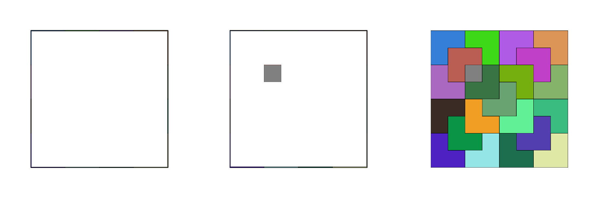

# Triminos
Résolution graphique d'un puzzle avec Turtle Graphics

## Introduction

*Ce projet a été réalisé dans le cadre scolaire au Lycée Evariste Galois en autonomie et durant des cours encadrés.*

Le programme découle de la curiosité mathématique suivante :

**Pour tout `n`, `2^n-1` est un multiple de 3.**

Cela signifie que s'il existe une grille de `2^n` carrés de coté, si nous retirons un carré n'importe où dans ce cadrillage, il serait possible de le remplir entièrement de "*triminos*", des pièces en forme d'escalier de trois carrés.

Ce programme python utilise la librairie `turtle` pour résoudre ce problème et placer automatiquement les triminos en fonction de la position du trou (le carré manquant). Le détail de l'algorithme utilisé est détaillé dans le pdf.

> Vous pouvez exécuter le fichier python depuis une machine possédant `python2` (`python3` ne supporte plus intégralement `turtle` et `TK`)

> Une version en ligne est disponible <a href="https://tuberculep.github.io/Triminos/">ici</a>
